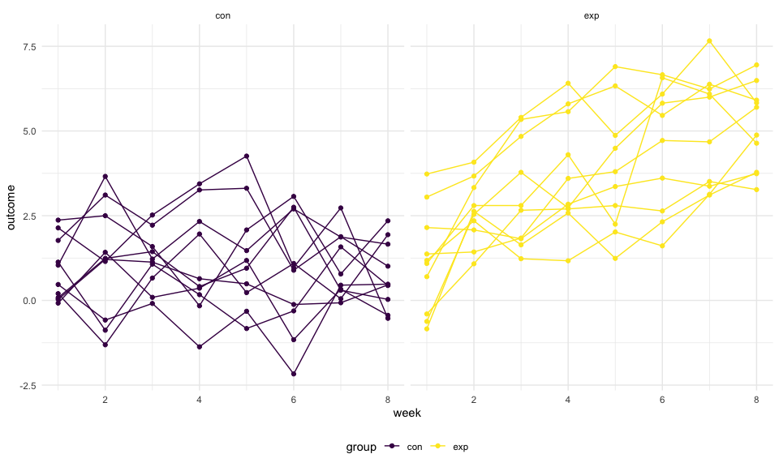
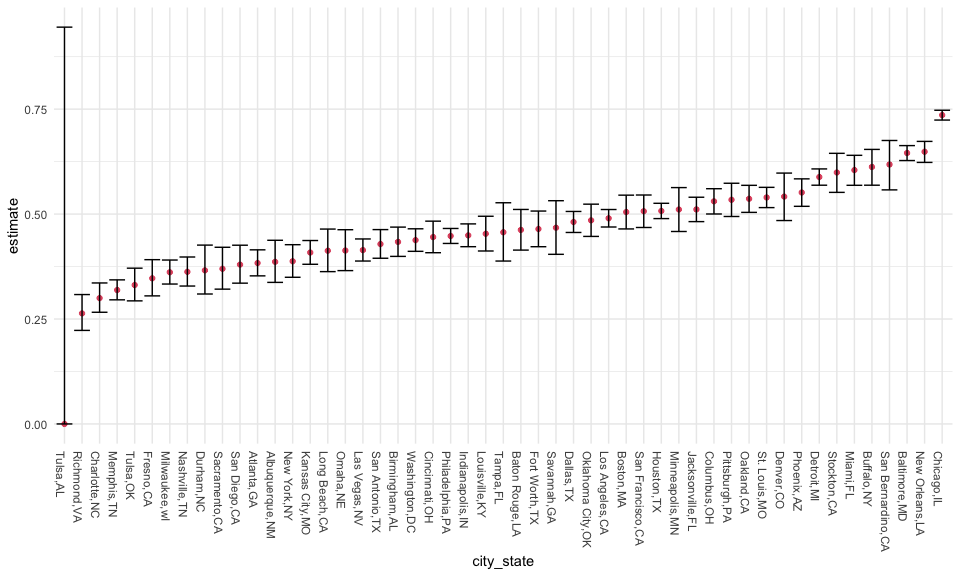
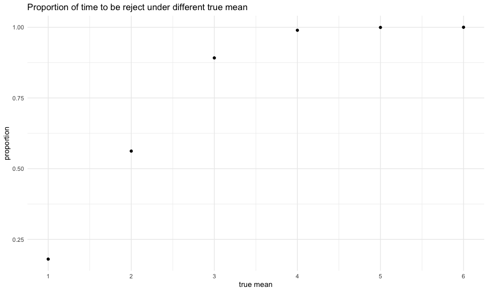
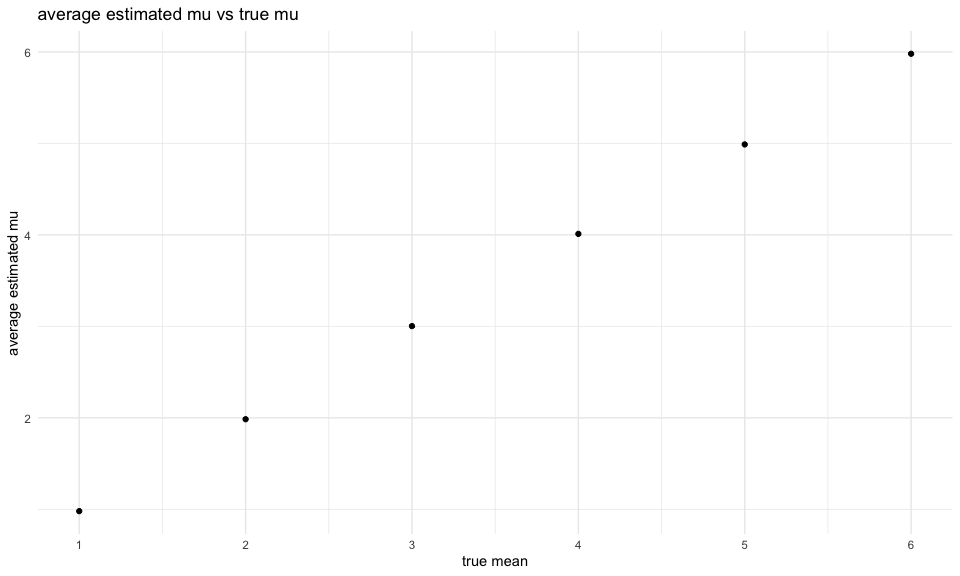

p8105_hw5_tw2838
================
Tianyou Wang
2022-11-16

## Setting Opotions

# Problem \#1 A Longitudinal Study

Code is downloaded from the partial solution provided by professor.

In the following code chunk, data in individual spreadsheets are
combined in one dataframe `full_df`.

``` r
full_df = 
  tibble(
    files = list.files("data/zip_data/"),
    path = str_c("data/zip_data/", files)
  ) %>% 
  mutate(data = map(path, read_csv)) %>% 
  unnest()
```

This R code chunk below transfer the wide format into long format. Only
the “group”, “subject”, “week” and “outcome” are presented.

``` r
tidy_df = 
  full_df %>% 
  mutate(
    files = str_replace(files, ".csv", ""),
    group = str_sub(files, 1, 3)) %>% 
  pivot_longer(
    week_1:week_8,
    names_to = "week",
    values_to = "outcome",
    names_prefix = "week_") %>% 
  mutate(week = as.numeric(week)) %>% 
  select(group, subj = files, week, outcome)
```

Finally, the code chunk below creates a plot showing individual data,
faceted by group.

``` r
tidy_df %>% 
  ggplot(aes(x = week, y = outcome, group = subj, color = group)) + 
  geom_point() + 
  geom_path() + 
  facet_grid(~group)
```



This plot suggests high within-subject correlation – subjects who start
above average end up above average, and those that start below average
end up below average. Subjects in the control group generally don’t
change over time, but those in the experiment group increase their
outcome in a roughly linear way.

# Problem \#2 A Homicides in 50 Large U.S. Cities

### *Data cleaning*

Import and clean the homicides csv file.

``` r
hom_df = read_csv("./data/homicide-data.csv") %>%
  janitor::clean_names() 
```

The raw homicides dataset includes 52179 observations and 12 variables,
including uid, reported_date, victim_last, victim_first, victim_race,
victim_age, victim_sex, city, state, lat, lon, disposition. Each row
contains information for one case of homicides.

``` r
hom_df = hom_df %>%
  mutate(city_state = str_c(city, state, sep = ","),
         solve_status = case_when(
           disposition == "Closed without arrest" ~ "unsolved",
           disposition == "Open/No arrest" ~ "unsolved",
           disposition == "Closed by arrest" ~ "solved")) %>% 
  relocate(city_state, solve_status)

summary_df = hom_df %>%
  group_by(city_state) %>% 
  summarise(n_hom = n(),
            n_unsolve = sum(solve_status == "unsolved"))

knitr::kable(summary_df)
```

| city_state        | n_hom | n_unsolve |
|:------------------|------:|----------:|
| Albuquerque,NM    |   378 |       146 |
| Atlanta,GA        |   973 |       373 |
| Baltimore,MD      |  2827 |      1825 |
| Baton Rouge,LA    |   424 |       196 |
| Birmingham,AL     |   800 |       347 |
| Boston,MA         |   614 |       310 |
| Buffalo,NY        |   521 |       319 |
| Charlotte,NC      |   687 |       206 |
| Chicago,IL        |  5535 |      4073 |
| Cincinnati,OH     |   694 |       309 |
| Columbus,OH       |  1084 |       575 |
| Dallas,TX         |  1567 |       754 |
| Denver,CO         |   312 |       169 |
| Detroit,MI        |  2519 |      1482 |
| Durham,NC         |   276 |       101 |
| Fort Worth,TX     |   549 |       255 |
| Fresno,CA         |   487 |       169 |
| Houston,TX        |  2942 |      1493 |
| Indianapolis,IN   |  1322 |       594 |
| Jacksonville,FL   |  1168 |       597 |
| Kansas City,MO    |  1190 |       486 |
| Las Vegas,NV      |  1381 |       572 |
| Long Beach,CA     |   378 |       156 |
| Los Angeles,CA    |  2257 |      1106 |
| Louisville,KY     |   576 |       261 |
| Memphis,TN        |  1514 |       483 |
| Miami,FL          |   744 |       450 |
| Milwaukee,wI      |  1115 |       403 |
| Minneapolis,MN    |   366 |       187 |
| Nashville,TN      |   767 |       278 |
| New Orleans,LA    |  1434 |       930 |
| New York,NY       |   627 |       243 |
| Oakland,CA        |   947 |       508 |
| Oklahoma City,OK  |   672 |       326 |
| Omaha,NE          |   409 |       169 |
| Philadelphia,PA   |  3037 |      1360 |
| Phoenix,AZ        |   914 |       504 |
| Pittsburgh,PA     |   631 |       337 |
| Richmond,VA       |   429 |       113 |
| Sacramento,CA     |   376 |       139 |
| San Antonio,TX    |   833 |       357 |
| San Bernardino,CA |   275 |       170 |
| San Diego,CA      |   461 |       175 |
| San Francisco,CA  |   663 |       336 |
| Savannah,GA       |   246 |       115 |
| St. Louis,MO      |  1677 |       905 |
| Stockton,CA       |   444 |       266 |
| Tampa,FL          |   208 |        95 |
| Tulsa,AL          |     1 |         0 |
| Tulsa,OK          |   583 |       193 |
| Washington,DC     |  1345 |       589 |

The code chunck above did:

-   created the `city_state` variable that include the city and state
    information by using `city_state = str_c()`
-   created the `solve_status` variable that indicate whether the
    homicide case is solved or unsolved
-   obtained the total number of homicides within each cities
-   obtained the number of unsolved homicides within each cities

### *Estimate the proportion of unsolved homicides in Baltimore, MD*

``` r
bal_df = summary_df %>% 
  filter(city_state == "Baltimore,MD")

test_output = prop.test(
  x = pull(bal_df, n_unsolve),
  n = pull(bal_df, n_hom)) %>% 
  broom::tidy()

list(
  proportion = round(test_output$estimate, 3),
  CI = str_c(round(test_output$conf.low, 3), 
             round(test_output$conf.high, 3)))
```

    ## $proportion
    ##     p 
    ## 0.646 
    ## 
    ## $CI
    ## [1] "0.6280.663"

By using the `prop.test` function, we estimated the proportion of
unsolved homicides in the city of Baltimore, MD, is 64.6% (95% CI:
62.8%, 0.663%).

### *Estimate the proportion of unsolved homicides in each city*

``` r
city_test = summary_df %>% 
  mutate(prop_test = map2(n_unsolve, n_hom, ~prop.test(.x, .y) %>% 
     broom::tidy())) %>%
    unnest() %>%
  select(city_state, estimate, conf.low, conf.high)

city_test
```

    ## # A tibble: 51 × 4
    ##    city_state     estimate conf.low conf.high
    ##    <chr>             <dbl>    <dbl>     <dbl>
    ##  1 Albuquerque,NM    0.386    0.337     0.438
    ##  2 Atlanta,GA        0.383    0.353     0.415
    ##  3 Baltimore,MD      0.646    0.628     0.663
    ##  4 Baton Rouge,LA    0.462    0.414     0.511
    ##  5 Birmingham,AL     0.434    0.399     0.469
    ##  6 Boston,MA         0.505    0.465     0.545
    ##  7 Buffalo,NY        0.612    0.569     0.654
    ##  8 Charlotte,NC      0.300    0.266     0.336
    ##  9 Chicago,IL        0.736    0.724     0.747
    ## 10 Cincinnati,OH     0.445    0.408     0.483
    ## # … with 41 more rows

### *Create a plot that shows the estimates and CIs for each city*

``` r
city_test %>% 
  mutate(city_state = fct_reorder(city_state, estimate)) %>% 
  ggplot(aes(x = city_state, y = estimate)) +
  geom_point(col=2) +
  geom_errorbar(aes(ymin = conf.low, ymax = conf.high)) +
  theme(axis.text.x = element_text(angle = 270, hjust=0))
```



# Problem \#3 Simulation: Explore Power in a One-Sample t-Test

### *Setting the function*

Write down the function:

``` r
one_samp_ttest = function(n=30, sigma=5, mu) {
  
  ttest_data = tibble(
    x = rnorm(n, mean = mu, sd = sigma))
  
  ttest_data %>% 
    t.test() %>% 
    broom::tidy()
}
```

Generate 5000 datasets from the model. For each dateset, save the mu_hat
and the coresponding p-values.

``` r
ttest_output = 
  expand_grid(
    true_mu = 0,
    iter = 1:5000
  ) %>% 
  mutate(
    mu_df = map(true_mu, ~one_samp_ttest(mu=.x))
  ) %>% 
  unnest(mu_df) %>% 
  select(mu_hat = estimate, p_value = p.value)
```

Repeating the above process for mu = (1, 2, 3, 4, 5, 6).

``` r
repeated_output = 
  expand_grid(
    true_mu = c(1, 2, 3, 4, 5, 6),
    iter = 1:5000
  ) %>% 
  mutate(
    mu_df = map(true_mu, ~one_samp_ttest(mu=.x))
  ) %>% 
  unnest(mu_df) %>% 
  select(true_mu, mu_hat = estimate, p_value = p.value)
```

### *Plot showing the proportion of times the null was rejected*

``` r
plot1_df = repeated_output %>% 
  mutate(decision = case_when(
           p_value >= 0.05 ~ "fail to reject",
           p_value < 0.05 ~ "reject")) %>% 
  group_by(true_mu) %>% 
  summarise(n_total = n(),
            n_rejct = sum(decision == "reject"),
            proportion = n_rejct/n_total)
```

``` r
plot1_df %>% 
  ggplot(aes(x = true_mu, y = proportion)) +
  geom_point() +
  labs(title = "Proportion of time to be reject under different true mean",
       x = "true mean",
       y = "proportion") +
  scale_x_continuous(
    breaks = c(1, 2, 3, 4, 5, 6)) +
  theme(legend.position = "None")
```



From the graph, we observed that the proportion of time to be reject
increase with increased true mean with fixed n=30, and sigma = 5.

### *More plots*

``` r
plot2_df = repeated_output %>% 
  group_by(true_mu) %>% 
  summarise(average = mean(mu_hat))
```

``` r
plot2_df %>% 
  ggplot(aes(x = true_mu, y = average)) +
  geom_point() +
  labs(title = "average estimated mu vs true mu",
       x = "true mean",
       y = "average estimated mu") +
  scale_x_continuous(
    breaks = c(1, 2, 3, 4, 5, 6)) +
  theme(legend.position = "None")
```



``` r
plot3_df = repeated_output %>% 
  mutate(decision = case_when(
           p_value >= 0.05 ~ "fail to reject",
           p_value < 0.05 ~ "reject")) 
```
